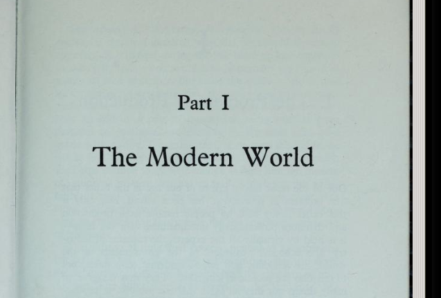

# Go energy efficiency

> Lightning Talk, [Leipzig Gophers](https://golangleipzig.space) [#32](https://golangleipzig.space/posts/meetup-32-invitation/), [Martin Czygan](https://www.linkedin.com/in/martin-czygan-58348842)

## Document [52021PC0558](https://eur-lex.europa.eu/legal-content/EN/TXT/?uri=CELEX:52021PC0558)

> ... to transform the EU into a fair and prosperous society, with a modern,
> resource-efficient and competitive economy where there are no net emissions
> of greenhouse gases in **2050** and where economic growth is **decoupled from
> resource use** [...] To reach these objectives, "energy efficiency must be prioritised".

Cf. [Small is beautiful: economics as if people mattered](https://openlibrary.org/works/OL1622912W/Small_Is_Beautiful) (1973)

## It's simple

> Energy efficiency simply means using less energy to perform the same task –
> that is, eliminating energy waste. --
> [https://www.eesi.org/topics/energy-efficiency/description](https://www.eesi.org/topics/energy-efficiency/description)

Many papers and whitepapers discussing EE:

* [Digitalization and energy consumption. Does ICT reduce energy demand?](https://fatcat.wiki/release/27wghdxkvvg5lfzk3vqs7vpxp4) (2020, cited [by 50+](https://fatcat.wiki/release/27wghdxkvvg5lfzk3vqs7vpxp4/refs-in))

## Anecdata

> We replaced a previous service with a Go implementation and we require 1/8 of the resources.

> Previously, we needed two servers, now we one is more than enough.

## Paper

